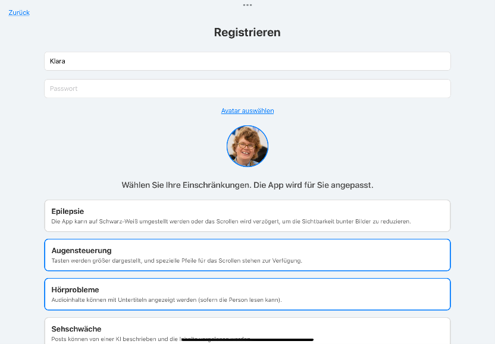
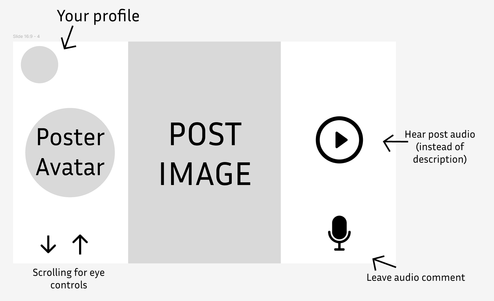
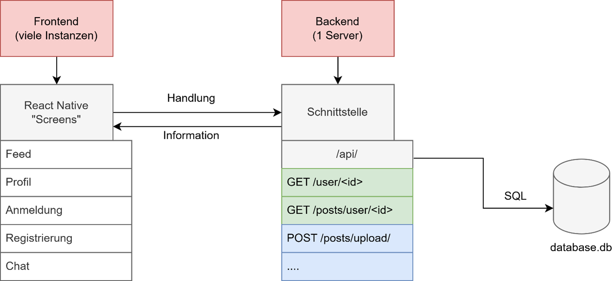

# IncluNet: an inclusive social network for illiterate and disabled people.


Disclaimer: This is currently a technical concept, not a fully running social network.

This app uses **no text** with communication solely via audio and images. Controls are as simple as possible.

### Unique Selling Proposition
- Communication only with pictures and audios
- The only (first) social media platform for people with disabilities
- Tailored to the needs of the disabled users
- No reading and writing skills required
- Intuitive operability

The registration page is currently in German. All other pages are languageless.
### Assistance in Setting Up
As illiterate individuals cannot enter their own account information and passwords, they need an external person (for example, a supervisor at the Caritas workshops) to create an account for the user and select their disabilities during registration.


### Concept
The app is based on simplicity. Here is a peak at our UX-Design.


## Technical Structure

This project consists of **Frontend** (*IncluNet/*) and **Backend** (*Backend/*).

**Frontend** (the app or website) runs on React Native, which allows us to operate the app on various platforms like Web, Android, and iOS. I currently use a 10.9'' 10th generation iPad (connected with Expo) to test the project. Audios and images are recorded or uploaded at this level and sent to the server. 


Project structure diagram, in German.

The **backend** runs on Flask (Python). It's an API that provides the app's server with data like posts. The current server with the data is currently set up at my home on a Raspberry Pi 5 8GB. The database with customer data uses SQLite. While SQLite is ideally suited for prototypes and tests, a NoSQL database should be introduced for better scalability before an MVP.

### Run the project
#### Run the backend:
Install all libraries from Backend/app.py (requirements.txt coming soon)
Then, run:
```
cd Backend/
```

```
python app.py
```

#### Run the frontend
Install all node packages:
```
cd IncluNet/
```

```
npm install
```

Run:
```
npm start
```
Use Expo on your mobile device (tablet) to open the app.
## Our partners
Thanks to our partners which helped us collect information: **Lebenshilfe Vorarlberg** and **Caritas Werkstätten** (Caritas Workshops). This organizations, which are based in Austria, offer support to people with disabilities through protected jobs, qualification measures, and individual promotion. They enable participation in working life, promote social integration, and strengthen personal development.
